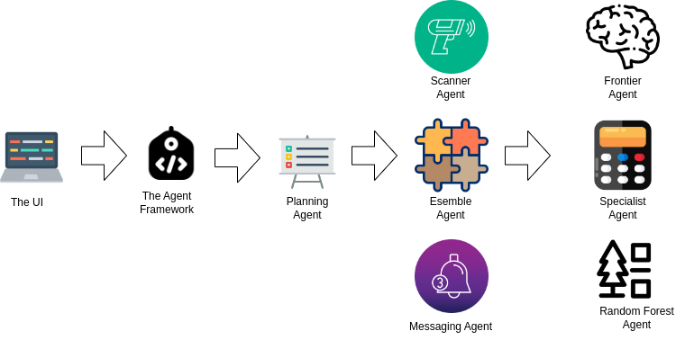

# 🧠 Ensemble Agent – Hybrid Price Estimator with Model Blending

The **Ensemble Agent** combines predictions from multiple specialized pricing models — including a frontier LLM, a specialist heuristic model, and a random forest model — and blends them using a trained **linear regression model**. This allows for more accurate, stable, and balanced price estimations from diverse inputs.


---



---

## 🚀 Features

- Integrates three predictive models:
  - ✅ `SpecialistAgent`: Rule-based or heuristic pricing
  - 🤖 `FrontierAgent`: OpenAI-based LLM estimator with retrieval augmentation
  - 🌲 `RandomForestAgent`: Tree-based machine learning model
- Combines their outputs using a trained **scikit-learn Linear Regression model**
- Uses min/max features in addition to model predictions for stronger generalization
- Modular, pluggable architecture (easily add more models)

---

## 📁 File Structure

```bash
ensemble_agent.py             # Main ensemble logic
ensemble_model.pkl            # Trained Linear Regression model
agents/
├── agent.py                  # Base Agent class
├── frontier_agent.py         # LLM + RAG agent
├── specialist_agent.py       # Rule-based estimator
└── random_forest_agent.py    # Machine learning model
```

---

## 🧰 Requirements

```bash
pip install pandas scikit-learn joblib
```

You’ll also need the local modules and the trained `ensemble_model.pkl` file.

---

## 🧠 How It Works

1. Each agent independently estimates the price of a product.
2. Their predictions, along with the min and max values, are passed to a linear regression model.
3. The ensemble model computes a final, weighted estimate.

---

## 🧪 Example Usage

```python
from ensemble_agent import EnsembleAgent

# Assume you have a ChromaDB collection for the FrontierAgent
ensemble = EnsembleAgent(collection)

description = "A smart watch with ECG, GPS, and 5-day battery life"
estimated_price = ensemble.price(description)

print(f"Estimated price: ${estimated_price:.2f}")
```

---

## 📊 Model Input Example

| Specialist | Frontier | RandomForest | Min   | Max   |
|------------|----------|--------------|-------|-------|
| 199.99     | 210.00   | 205.50       | 199.99| 210.00|

---

## 📦 Training the Ensemble Model

The `ensemble_model.pkl` is assumed to be trained offline using historical prediction data. You can train it using:

```python
from sklearn.linear_model import LinearRegression
import joblib
import pandas as pd

# Example training data
X = pd.read_csv("model_inputs.csv")  # contains Specialist, Frontier, RandomForest, Min, Max
y = pd.read_csv("actual_prices.csv")["Price"]

model = LinearRegression()
model.fit(X, y)
joblib.dump(model, "ensemble_model.pkl")
```

---

## 🔐 Notes

- Ensure the `FrontierAgent` has access to its necessary vector DB and OpenAI credentials.
- Make sure the `.pkl` model is up to date with your prediction logic.

---

## 📜 License

MIT © 2025

---

## 🙌 Credits

- OpenAI (GPT models)
- HuggingFace SentenceTransformers
- Scikit-learn
